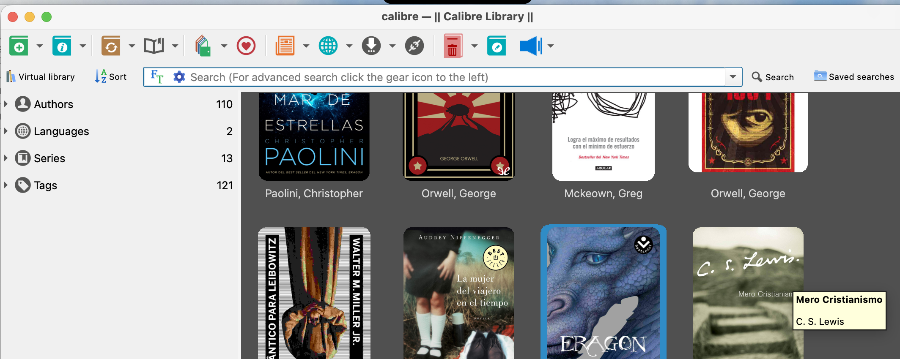
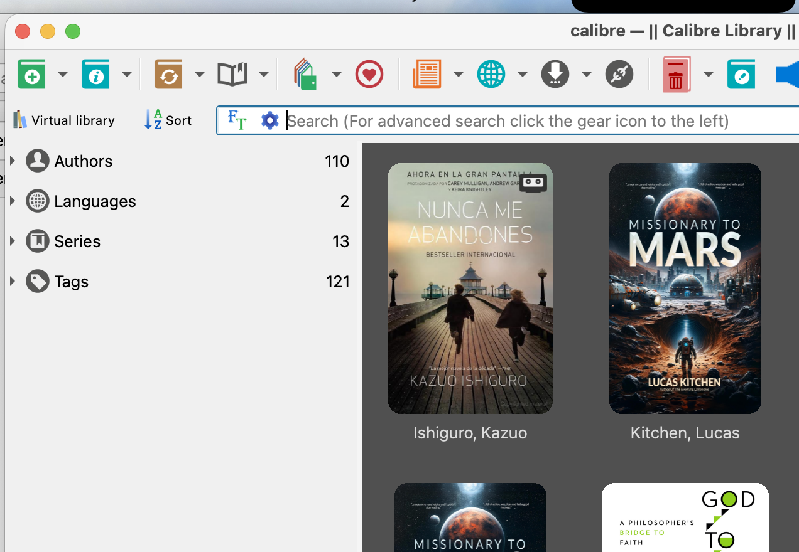
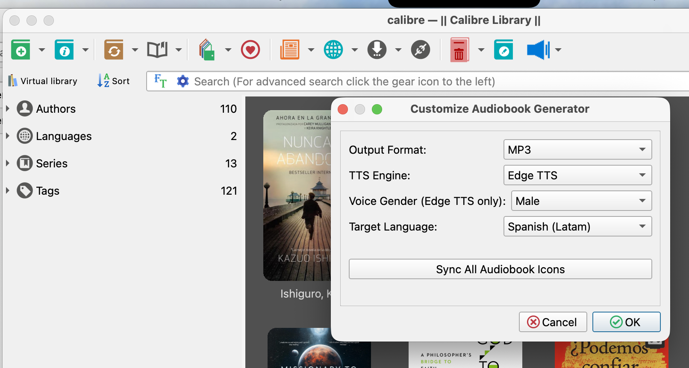

# Calibre Audiobook Generator Plugin

A Calibre plugin that generates high-quality audiobooks (MP3) from your ebooks using modern Text-to-Speech (TTS) engines.


## Screenshots

### Main Toolbar


### Cassette Emblem on Library Covers


### Configuration Settings


## Features

- **Multiple TTS Engines**: 
  - **Edge TTS**: Uses Microsoft Edge's high-quality neural voices (Default).
  - **gTTS**: Google Text-to-Speech fallback.
- **Language Support**: Support for English and Spanish (Latam).
- **Voice Selection**: Choose between Male and Female neural voices.
- **Library Integration**: Automatically adds the generated MP3 as a new format to your existing Calibre book entry.
- **Progress Tracking**: Real-time status updates in Calibre's status bar and a progress dialog.
- **Clean Extraction**: Automatically strips HTML tags, scripts, and styles from EPUBs to ensure clean audio.

## Installation

### Prerequisites
- [Calibre](https://calibre-ebook.com/) installed on your system.
- An active internet connection (required for TTS generation).

### Installation via Calibre
1. Download the latest release (ZIP file).
2. Open Calibre and go to **Preferences > Advanced > Plugins**.
3. Click **Load plugin from file** and select the downloaded ZIP.
4. Restart Calibre.
5. Add the "Audiobook Generator" button to your toolbar:
   - Go to **Preferences > Interface > Toolbars & menus**.
   - Select **The main toolbar**.
   - Find **Audiobook Generator** in the left column and move it to the right.
   - Click **Apply** and restart Calibre.

### Installation for Developers (CLI)
If you are developing or testing the plugin:
```bash
# Clone the repository
git clone https://github.com/yourusername/calibre-audiobook.git
cd calibre-audiobook

# Install dependencies into the vendor folder (requires pip)
pip install -r PipFile -t vendor

# Install into Calibre
calibre-customize -b .
```

## Configuration

You can customize the plugin by going to **Preferences > Advanced > Plugins > User interface action plugins > Audiobook Generator > Customize plugin**.

Available settings:
- **TTS Engine**: Choose between Edge TTS and gTTS.
- **Voice Gender**: Select Male or Female (primarily for Edge TTS).
- **Target Language**: Set the language for the speech synthesis.

## Usage

1. Select a book in your Calibre library (must have an **EPUB** format).
2. Click the **Audiobook Generator** button in the toolbar.
3. Confirm the generation details in the dialog.
4. Wait for the process to finish (check the status bar for progress).
5. The **MP3** format will be added to the book's available formats in the right-hand panel.

## Development

The project uses a `vendor/` directory to bundle pure-Python dependencies, ensuring portability across different Calibre installations without requiring users to install Python packages manually.

Dependencies are tracked in the `Pipfile`.

## Credits

- **Author**: Miguel Aguero
- **Libraries**: [edge-tts](https://github.com/rany2/edge-tts), [gTTS](https://github.com/pndurette/gTTS), [BeautifulSoup4](https://www.crummy.com/software/BeautifulSoup/)

## License

This project is licensed under the GNU General Public License (GPL) - see the LICENSE file for details.
